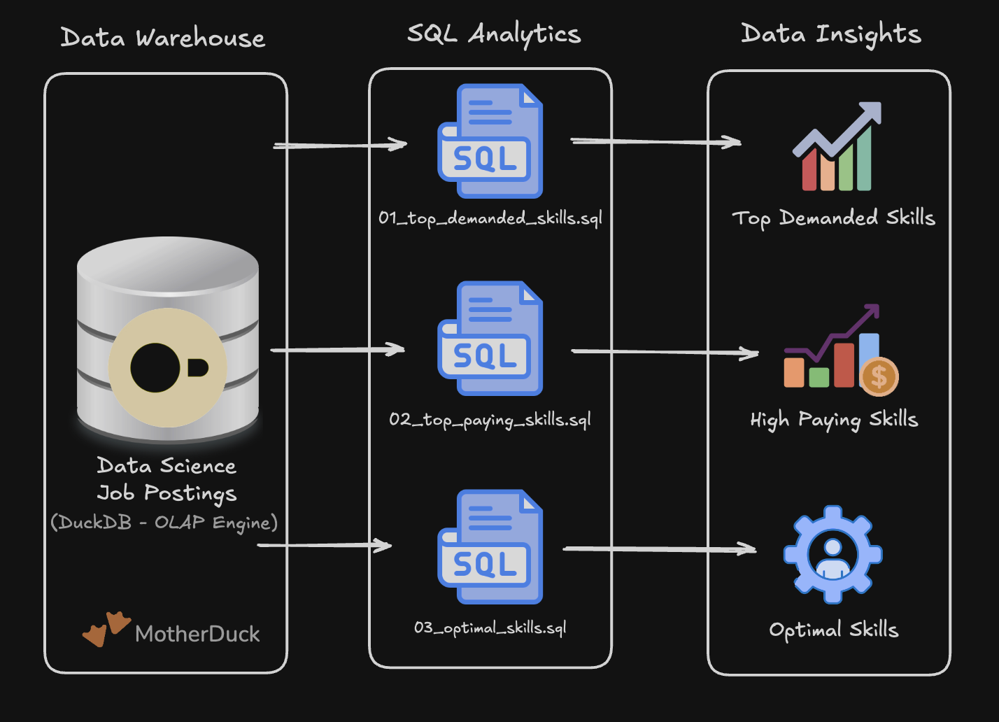

# Exploratory Data Analysis w/ SQL: Job Market Analytics 

A SQL project analyzing the data engineer job market using real world job posting data. It demonstrates my ability **to write production-quality analytical SQL, design efficient queries, and turn business questions into data-driven insights.**

# Problem & Context

Job market analysts need to answer questions like:

- **Most in-demand**: Which skills are most in-demand for data engineers?
- **Highest paid**: Which skills command the highest salaries?
- **Best trade-off**: What is the optimal skill set balancing demand and compensation?

This project analyzes a data warehouse built using a star schema design. The warehouse structure consists of:

# Tech Stack
- **Query Engine**: DuckDB for fast OLAP-style analytical queries
- **Language**: SQL (ANSI-style with analytical functions)
- **Data Model**: Star schema with fact + dimension + bridge tables
- **Development**: VS Code for SQL editing + Terminal for DuckDB CLI
- **Version Control**: Git/GitHub for versioned SQL scripts

# Analysis Overview
1. [Top Demanded Skills](01_top_demand_skill.sql) – Identifies the 10 most in-demand skills for remote data engineer positions
2. [Top Paying Skills](02_top_paying_skill.sql) – Analyzes the 25 highest-paying skills with salary and demand metrics
3. [Optimal Skills](03_top_optimal_skill.sql) – Calculates an optimal score using natural log of demand combined with median salary to identify the most valuable skills to learn

# Key insights
- Core languages: SQL and Python each appear in ~29,000 job postings, making them the most demanded skills
- Cloud platforms: AWS and Azure are critical for modern data engineering roles-
- Infra & tooling: Kubernetes, Docker, and Terraform are associated with premium salaries
- Big data tools: Apache Spark shows strong demand with competitive compensation

# SQL Skills Demonstrated

## Query Design & optimization
- **Complex Joins**: Multi-table INNER JOIN operations across job_postings_fact, skills_job_dim, and skills_dim
- **Aggregations**: COUNT(), MEDIAN(), ROUND() for statistical analysis
- **Filtering**: Boolean logic with WHERE clauses and multiple conditions (job_title_short, job_work_from_home, salary_year_avg IS NOT NULL)
- **Sorting & Limiting**: ORDER BY with DESC and LIMIT for top-N analysis

## Data Analysis Tehniques
- **Grouping**: GROUP BY for categorical analysis by skill
- **Mathematical Functions**: LN() for natural logarithm transformation to normalize demand metrics
- **Calculated Metrics**: Derived optimal score combining log-transformed demand with median salary
- **HAVING Clause**: Filtering aggregated results (skills with >= 100 postings)
- **NULL Handling**: Proper filtering of incomplete records (salary_year_avg IS NOT NULL)
